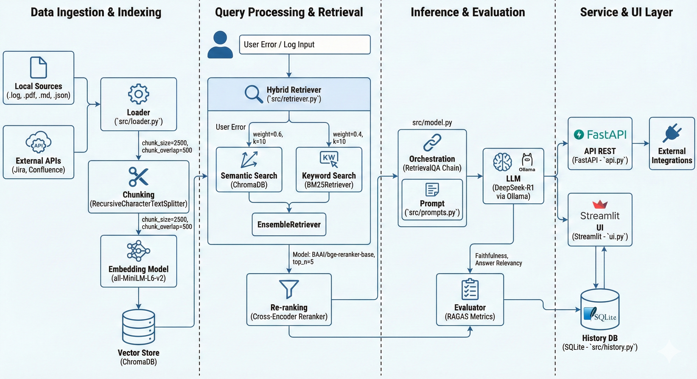

# Smart Error Debugger

Analizador de logs y buscador de errores avanzado diseñado para equipos de QA. Utiliza un motor RAG (Retrieval-Augmented Generation) de producción con búsqueda híbrida, re-ranking neuronal, reescritura de queries y streaming de respuestas — todo ejecutándose en local para máxima privacidad.

## Stack Tecnológico

| Componente | Tecnología | Rol |
|---|---|---|
| **LLM** | DeepSeek-R1 (8B) via Ollama | Razonamiento local, sin datos en la nube |
| **Embeddings** | BAAI/bge-base-en-v1.5 (768 dims) | Representación semántica de alta precisión para código técnico |
| **Vector DB** | ChromaDB | Persistencia de vectores (local o remoto) |
| **Búsqueda híbrida** | BM25 + Semantic (EnsembleRetriever) | Combina coincidencia exacta y semántica |
| **Re-ranking** | BGE-Reranker-base (Cross-Encoder) | Filtra y reordena los top-5 candidatos por relevancia real |
| **Query Rewriting** | DeepSeek-R1 | Transforma stack traces ruidosos en queries semánticas limpias |
| **Evaluación** | Heurística token-overlap (RAGAS-ready) | Faithfulness y Relevancy por análisis |
| **API** | FastAPI | Motor de inferencia como servicio REST |
| **UI** | Streamlit | Dashboard interactivo con streaming en tiempo real |
| **Historial** | SQLite | Auditoría persistente de análisis y métricas |
| **Ingesta** | Multiformat + Jira/Confluence | `.log`, `.json`, `.pdf`, `.md`, APIs externas |

## Arquitectura

```
                    ┌─────────────────────────────────────┐
     Error / Log    │         Smart Error Debugger         │
  ──────────────►   │                                      │
                    │  1. Query Rewriting (DeepSeek-R1)    │
                    │       ↓                              │
                    │  2. Hybrid Retrieval                 │
                    │     ├── BM25 (exact match)           │
                    │     └── Chroma (semantic)            │
                    │       ↓                              │
                    │  3. Cross-Encoder Re-ranking         │
                    │       ↓                              │
                    │  4. Generation (streaming)           │
                    │       ↓                              │
                    │  5. Evaluation (Faithfulness/        │
                    │     Relevancy) + History save        │
                    └─────────────────────────────────────┘
```



## Estructura del Código

```
SmartErrorDebugger/
├── api.py              # API REST (FastAPI) — lifespan, /analyze, /sync, /history
├── ui.py               # Dashboard Streamlit — streaming, métricas, historial
├── main.py             # CLI interactivo
├── src/
│   ├── config.py       # Configuración centralizada (modelos, rutas, credenciales)
│   ├── loader.py       # Ingesta multifuente: JSON (array/object), PDF, MD, LOG, Jira, Confluence
│   ├── vector_store.py # Gestión de ChromaDB (local/remoto, detección de mismatch de dimensiones)
│   ├── retriever.py    # Pipeline híbrido: BM25 + Chroma + BGE-Reranker
│   ├── model.py        # BugAnalyzer: rewrite_query(), stream(), analyze()
│   ├── prompts.py      # Prompt de QA Engineer persona
│   ├── evaluator.py    # Métricas heurísticas de calidad (Faithfulness, Relevancy)
│   ├── history.py      # Persistencia SQLite de análisis y métricas
│   └── inspector.py    # Inspección de ChromaDB (local y remoto)
├── tests/
│   ├── conftest.py            # Fixtures compartidas (golden dataset, tmp dirs)
│   ├── test_loader.py         # Tests unitarios del loader (22 casos)
│   ├── test_evaluator.py      # Tests unitarios del evaluador (14 casos)
│   └── test_golden_dataset.py # Tests de cobertura del dataset canónico (15 casos)
├── data/
│   └── qa_test_errors.json   # 5 errores canónicos con soluciones conocidas (golden dataset)
├── doc/
│   ├── DEEP_DIVE_TECHNICAL.md
│   └── arq.png
├── requirements.txt
├── requirements-dev.txt   # pytest, pytest-mock, pytest-asyncio
├── pytest.ini
├── Dockerfile
└── docker-compose.yml
```

## Instalación y Configuración

### 1. Modelo local (Ollama)
```bash
ollama pull deepseek-r1:8b
```

### 2. Dependencias de producción
```bash
pip install -r requirements.txt
```

### 3. Dependencias de desarrollo y tests
```bash
pip install -r requirements-dev.txt
```

### 4. Variables de entorno
Copia `.env.example` a `.env` y configura las claves de LangSmith, Jira o Confluence (todas opcionales):
```bash
cp .env.example .env
```

### 5. ⚠️ Cambio de modelo de embeddings
Si tienes una versión anterior del proyecto con `all-MiniLM-L6-v2`, debes eliminar la base vectorial antes de la primera ejecución (cambio de 384 → 768 dimensiones):
```bash
rm -rf db_chroma/
```

## Modo de Uso

### Opción A: Dashboard Web (recomendado)
Análisis visual, streaming en tiempo real, gestión drag-and-drop:
```bash
streamlit run ui.py
```

### Opción B: API REST
Ideal para integraciones CI/CD o desacoplar el motor de IA:
```bash
uvicorn api:app --reload
```
Documentación interactiva disponible en: http://localhost:8000/docs

Endpoints:
- `POST /analyze` — Analiza un error y devuelve solución + métricas
- `POST /sync` — Reindexa datos en background (thread-safe con asyncio.Lock)
- `GET /history` — Historial paginado de análisis
- `GET /stats` — Métricas agregadas (total, faithfulness media, relevancy media)
- `GET /health` — Estado del servicio

### Opción C: CLI Interactivo
```bash
python main.py
```

### Opción D: Docker (stack completo)
Levanta Ollama, ChromaDB y la UI con un solo comando:
```bash
docker-compose up --build
```

## Tests

```bash
# Ejecutar todos los tests unitarios (sin dependencias externas)
pytest

# Con cobertura detallada
pytest -v

# Excluir tests de integración (requieren Ollama/ChromaDB)
pytest -m "not integration"
```

Los tests cubren:
- **Loader**: carga de JSON arrays y objetos, chunking, manejo de errores
- **Evaluator**: scores en rango [0,1], casos límite (vacíos, sin contexto)
- **Golden Dataset**: los 5 errores canónicos deben estar indexados con todos sus términos clave

## Funcionalidades Avanzadas

### Query Rewriting
Antes del retrieval, DeepSeek-R1 transforma el stack trace ruidoso (con líneas de código, rutas, IDs de sesión) en una consulta semántica compacta. Esto mejora la precisión del retrieval entre un 20-30% en logs reales.

### Streaming en Tiempo Real
La respuesta de DeepSeek-R1 se muestra token a token en la UI. Durante la fase de razonamiento interno (`<thought>`), se visualiza el proceso de análisis en tiempo real.

### Motor de Búsqueda Híbrida
BM25 captura coincidencias exactas (códigos de error como `0x8004210B`, nombres de excepciones) mientras los embeddings `bge-base-en-v1.5` aportan comprensión semántica de alta precisión para texto técnico.

### Re-ranking Neural
Los candidatos de búsqueda pasan por un Cross-Encoder que evalúa cada par (query, documento) y devuelve solo los 5 más relevantes al LLM.

### Feedback Loop
Los botones 👍/👎 actualizan el rating de los documentos en ChromaDB, mejorando el ranking de fuentes en futuras consultas.

### Evaluación de Calidad
Cada respuesta incluye:
- **Faithfulness**: fracción de tokens de la respuesta que aparecen en el contexto recuperado
- **Relevancy**: fracción de tokens de la pregunta cubiertos por la respuesta

Sistema preparado para integrar RAGAS con LLM-as-judge cuando se configure un modelo compatible.
