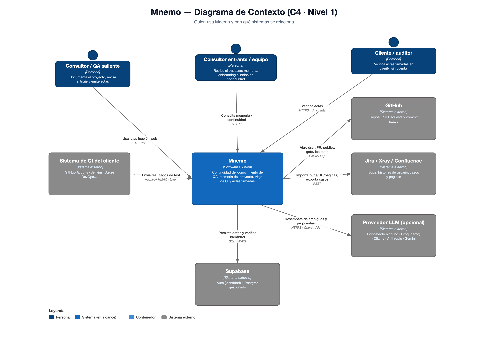
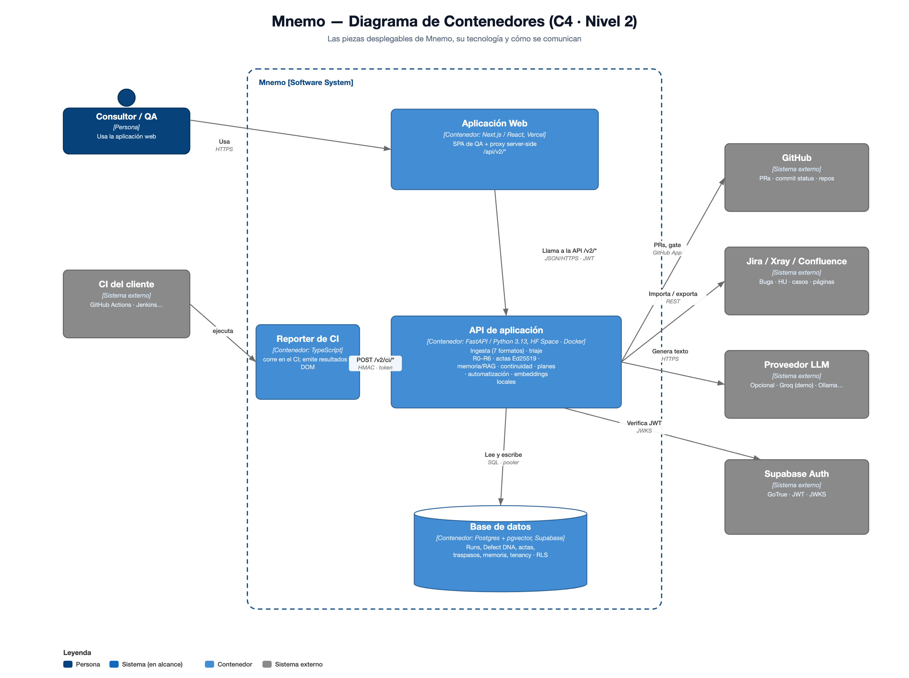
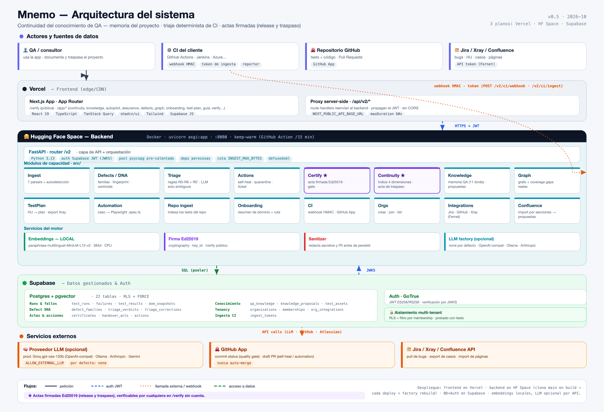

# Mnemo — Arquitectura técnica

## Visión: continuidad del conocimiento de QA

Mnemo es una plataforma de **continuidad del conocimiento de QA**: cuando un consultor rota, lo que sabía del proyecto (familias de defecto y su porqué, reglas de negocio, runbooks, datos de prueba, contactos, decisiones) se queda en la memoria del proyecto, se mide con un índice de continuidad y se entrega con un **acta de traspaso firmada**. El lazo de CI (ingesta → triaje determinista → acta de release firmada) es la **fuente que alimenta esa memoria**, no el centro del producto.

## Diagramas de arquitectura

### Modelo C4 (notación estándar)

Diagramas [C4](https://c4model.com/) — el estándar para comunicar arquitectura de software por niveles.

**Nivel 1 · Contexto** — quién usa Mnemo y con qué sistemas se relaciona:



**Nivel 2 · Contenedores** — las piezas desplegables, su tecnología y cómo se comunican:



> Fuente vectorial: [`img/mnemo-c4-context.svg`](img/mnemo-c4-context.svg) · [`img/mnemo-c4-container.svg`](img/mnemo-c4-container.svg) · regenerables con [`img/c4.py`](img/c4.py) (`python3 c4.py`).

### Vista de despliegue e infraestructura (infografía)

Complementa el C4 con el detalle de los módulos internos, los servicios del motor, el modelo de datos y los flujos, sobre los tres planos de despliegue (Vercel · Hugging Face Space · Supabase):



> Fuente vectorial editable: [`img/mnemo-arquitectura.svg`](img/mnemo-arquitectura.svg) · regenerable con [`img/arch_diagram.py`](img/arch_diagram.py) (`python3 arch_diagram.py`).

## Stack

- **Backend:** Python 3.13, FastAPI.
- **Embeddings locales:** `paraphrase-multilingual-MiniLM-L12-v2` (384 dims, CPU) vía HuggingFace, configurable con `EMBEDDING_MODEL` (`src/config.py`). Se eligió multilingüe porque el modelo inglés anterior apenas separaba señal de ruido en textos en español. Cambiar de modelo obliga a re-embeber lo existente (`scripts/reembed.py`) y a recalibrar los umbrales (ver más abajo).
- **LLM opcional e intercambiable** (`src/llm/factory.py`): `LLM_PROVIDER` vale `none` por defecto y, en ese caso, todo degrada a la vía determinista. Proveedores disponibles: cualquier API compatible OpenAI vía `OPENAI_BASE_URL` (producción usa `openai/gpt-oss-120b` en Groq por esa vía), Anthropic u Ollama si se configura. Los proveedores externos exigen opt-in explícito (`ALLOW_EXTERNAL_LLM=true`) porque envían datos de fallos a un tercero.
- **Datos:** **Postgres + pgvector** (Supabase). Auth: **Supabase JWT** (verificación por JWKS).
- **Frontend:** Next.js (App Router) + React + TypeScript + TanStack Query + shadcn/ui; auth Supabase.

## Capas

```
  Frontend Next.js
  (público: /verify · app: /app/{continuity,knowledge,autopilot,assurance,calibration,
   defects,graph,onboarding,test-plan,guia,verify,integrations,org,settings})
                       │  (proxy /api/v2/* → backend /v2/*)
                       ▼
   FastAPI  asgi.py ──include──►  src/api_v2.py  (router /v2, auth JWT, deps perezosas)
                       │
      ┌────────────────┼──────────────────────────────┬──────────────────────────┐
      ▼                ▼                              ▼                          ▼
  Ingest+Triage    Continuity+Knowledge+Graph    TestPlan+Xray         Automation+CI+Repo
  (src/ingest/     (src/continuity/              (src/testplan/        (src/automation/
   src/defects/     src/knowledge/                src/xray/)            src/ci/
   src/triage/      src/confluence/                                     src/repo_ingest/)
   src/actions/     src/graph/)
   src/certify/)
      │                │                              │                          │
  Postgres+pgvector   Postgres+pgvector             LLM provider          GitHub App
  LLM (opcional)      LLM (opcional)                Xray API
```

## Módulos de capacidad

| Módulo | Ruta | Responsabilidad |
|--------|------|-----------------|
| **Continuity** | `src/continuity/` | Índice de continuidad por proyecto (determinista, 100 % SQL) y **acta de traspaso** firmada (`mnemo.traspaso.v1`, tabla `handover_acts`); emitirla exige rol owner/admin |
| **Ingest** | `src/ingest/` | Parsers de **7 formatos** de report (Allure, JUnit, TestNG, Robot, Playwright, Cypress, Cucumber) + autodetección (`detect.py`), modelos, red de seguridad anti-falso-verde |
| **Defects / Defect DNA** | `src/defects/` | AssuranceRepository, fingerprint, embedder, match, centroid, IngestionService; `src/assurance/`: verdict + narrator |
| **Triage** | `src/triage/` | Motor de reglas R0–R6 + `R0_prior_contradicted` (determinista) + `LLMTiebreaker` para ambiguos (`llm_assisted`) |
| **Actions** | `src/actions/` | ActionService + ActionRepository: propone y materializa acciones (quarantine/ticket/self_heal) |
| **Certify** | `src/certify/` | Firma **Ed25519** y verificación de actas (release y traspaso); GateService |
| **Knowledge** | `src/knowledge/` | Memoria de QA (11 kinds), búsqueda semántica, bandeja de propuestas («la IA propone, el humano aprueba») e import de Jira/Confluence por secciones |
| **Graph** | `src/graph/` | GraphService: grafo de conocimiento (dominios → familias → ítems); `gaps.py`: huecos de cobertura cruzando memoria × test assets |
| **TestPlan** | `src/testplan/` | Generación de planes de prueba desde HUs; `src/xray/`: exportación a Jira/Xray |
| **Automation** | `src/automation/` | Generación de tests Playwright (.spec.ts); estilo few-shot desde los test assets del repo |
| **Repo ingest** | `src/repo_ingest/` | Indexa los tests del repo GitHub de la org como `test_assets`; `descriptor.py` decide qué texto se embebe de cada test (títulos, comentarios, ruta) |
| **CI** | `src/ci/` | Webhook CI (HMAC), ingesta genérica por token (`ingest_tokens`), GitHub App auth, CiIngestionService (atómica e idempotente por `run_uid`) |
| **Onboarding** | `src/onboarding/` | domain_summary + learning_path usando KnowledgeService |
| **Orgs** | `src/orgs/` | OrganizationRepository: create, join, list |
| **Integrations** | `src/jira/`, `src/confluence/` | IntegrationsRepository: upsert/get de configuraciones Jira, GitHub y Xray (cifrado Fernet, `MNEMO_SECRET_KEY`); clientes Jira y Confluence |
| **AI** | `src/ai/` | nl_query (ask), briefing, generate, judge (LLM-judge → `ai_eval` informativo del acta) |
| **LLM** | `src/llm/` | Providers intercambiables: factory, openai-compatible, anthropic, ollama, reasoning |
| **Infra** | `src/security.py`, `src/db/pool.py`, `src/sanitizer.py`, `src/demo/` | Auth JWT (JWKS/HS256), pool de conexiones pre-calentado en lifespan, redacción de secretos/PII, seed de demo |

## Principios de diseño

**Funciones puras** donde se pueda (parsers, fingerprint, match, centroid, verdict, índice de continuidad → testeables sin BD/LLM). **Dependencias inyectables y perezosas** (embedder, narrator, repo) para no cargar modelos en import y poder mockear. **Determinismo donde se firma**: la ingesta, el motor de reglas del triaje y el índice de continuidad son deterministas (embeddings + SQL); el LLM no entra en nada que acabe decidiendo un payload firmado. Los casos ambiguos (regla `R6`) pasan por un desempate LLM, si hay proveedor, y quedan marcados `llm_assisted` — y un acta con cualquier veredicto asistido **nunca** es un `apto` rotundo. Todo lo LLM degrada con elegancia si el proveedor no está configurado o no responde.

## Continuidad del conocimiento

### Índice de continuidad (`src/continuity/index.py`)

Responde a «¿cuánto de este proyecto sabe Mnemo?» con cuatro dimensiones ponderadas, calculadas por SQL sobre los datos del proyecto:

| Dimensión | Peso | Qué mide |
|-----------|------|----------|
| Memoria de defectos | 0,35 | familias recurrentes (≥2 apariciones) con conocimiento activo asociado |
| El porqué de las etiquetas | 0,25 | familias etiquetadas por un humano cuya corrección lleva razón escrita |
| Oficio del proyecto | 0,25 | cuántos de los 4 kinds operativos (`runbook`, `dato_prueba`, `contacto`, `decision`) tienen al menos un ítem |
| Reglas con respaldo | 0,15 | reglas de negocio y riesgos con una lección o patrón del mismo dominio y proyecto |

El índice es la media ponderada de las dimensiones con denominador; sin ninguna, queda «sin datos suficientes» en lugar de un 0 o un 100. Los pesos viven en código (no en una migración) y viajan dentro del acta, de modo que dos actas con pesos distintos siguen siendo comparables.

### Acta de traspaso (`src/continuity/service.py`)

`POST /v2/continuity/handover` calcula el índice, construye el payload canónico con `schema: mnemo.traspaso.v1`, lo firma con la misma cadena Ed25519 del acta de release y lo guarda en `handover_acts`. `created_at` lo inyecta el endpoint para que lo firmado sea reproducible. Se verifica por la misma puerta pública (`/verify`, sin cuenta), que es agnóstica del payload: solo el campo `schema` distingue un acta de otra.

### Cómo se puebla la memoria

- **Alta manual** (`POST /v2/knowledge`), con 11 kinds: 7 sobre el producto y sus fallos (`regla_negocio`, `flujo`, `riesgo`, `glosario`, `leccion`, `reto`, `patron`) y 4 del oficio del proyecto (`runbook`, `dato_prueba`, `contacto`, `decision`).
- **Propuestas tras cada ingesta**: una `BackgroundTask` posterior a la respuesta genera borradores de lección para familias sin conocimiento (tope de 3 por ingesta). Requiere LLM configurado; sin él se omite. Nada entra en `qa_knowledge` sin aprobación humana.
- **Import de Jira/Confluence** (`POST /v2/knowledge/import`): determinista, sin LLM; cada página de Confluence se trocea por sus encabezados (`src/knowledge/sectioning.py`) y cada sección llega a la bandeja como propuesta.
- **La razón del etiquetador**: al corregir el triaje de una familia, la razón escrita se guarda con su propio embedding (`triage_corrections.reason_embedding`) y pasa a ser buscable.

## Flujo de CI (fuente de la memoria)

```
POST /v2/ci/webhook (artefacto firmado HMAC)  ·  POST /v2/ci/ingest (token de ingesta)
  (procesado en threadpool, fuera del event loop)
  → CiIngestionService → test_run + failures + defect_families   (idempotente por run_uid)
  → TriageService → triage_verdicts (R0–R6 + R0_prior_contradicted; ambiguos → desempate LLM)
  → CertificateService → acta de release firmada Ed25519
  → GateService → commit status en GitHub
  → BackgroundTask → propuestas de conocimiento (si hay LLM)
         │
         ▼  las correcciones humanas (re-etiquetado de familias, con razón) alimentan:
  triage_corrections → calibración del motor y memoria buscable
```

### Motor de triaje (`src/triage/engine.py`)

Reglas por prioridad: `R0_calibrated` aplica la etiqueta humana de la familia como prior; `R1` flaky (reintento verde o intermitencia en el mismo SHA); `R2` infra (cofallo masivo + error de entorno); `R3` mantenimiento (localizador roto con DOM cambiado y línea base verde); `R4`/`R5` real recurrente/novedoso; `R6` ambiguo (`unknown`, desempate LLM).

**`R0_prior_contradicted`**: un prior `flaky` o `infra` (las etiquetas que silencian un fallo) cede cuando la evidencia del fallo actual es una aserción pura sin rastro de intermitencia, error de entorno ni, en el caso flaky, firma de localizador. El veredicto queda `unknown` con aprobación humana obligatoria, lo que fuerza `no-apto` hasta que alguien lo revise. Si un humano reafirma la etiqueta frente al conflicto, manda su decisión.

**Calibración**: por familia se compara la última etiqueta humana con la última **predicción independiente** del motor anterior a ella; los ecos de R0 (el motor repitiendo la etiqueta humana) no cuentan. El `self_eval` del acta declara `method: deterministic_v2`, que versiona el conjunto de reglas.

## Flujo de ingesta manual

```
POST /v2/ingest/report (multipart: file, project, source, org_id)
  → IngestionService.ingest_report
      detect_source/parser(source) → FailureRecord[]
      por cada fallo: sanitize_text → fingerprint → embed
      run_uid = hash del archivo (re-subir el mismo reporte deduplica)
      → AssuranceRepository.ingest_run (una transacción):
          verifica membership (PermissionError si no)
          crea test_run
          por cada item: coseno → decide_match
              nuevo → crea defect_family (centroid=embedding, occ=1)
              conocido → update_centroid + occ+1 + last_seen
          inserta failure (con defect_family_id)
  ← {run_id, ingested, known, novel, deduplicated}
```

## Umbrales semánticos

Calibrados para el modelo multilingüe; si cambia `EMBEDDING_MODEL`, hay que recalibrarlos.

| Umbral | Valor | Dónde | Uso |
|--------|-------|-------|-----|
| `MATCH_THRESHOLD` | 0,90 (similitud coseno) | `src/defects/match.py` | `decide_match`: un fallo se une a una familia existente o abre una nueva |
| `MAX_SEMANTIC_DISTANCE` | 0,75 (distancia coseno, configurable) | `src/config.py` | corte de las búsquedas semánticas de memoria y familias |
| `_COVERAGE_THRESHOLD` | 0,42 (distancia coseno) | `src/graph/gaps.py` | una regla de negocio cuenta como cubierta si un test queda por debajo; el test se embebe con su descriptor (`src/repo_ingest/descriptor.py`) |

**Búsqueda de familias**: la distancia de una familia a la consulta es la media entre la distancia a su centroide y la distancia a la razón del etiquetador (`reason_embedding`); si la familia no tiene razón, cuenta solo el centroide. Se descartan las que superan `MAX_SEMANTIC_DISTANCE`.

## Acta de release y política de veredicto (§7.1)

- **Firma Ed25519** (`src/certify/signing.py`) sobre el **JSON canónico** determinista del acta; el `key_id` (SHA-256 truncado de la clave pública) viaja dentro y habilita rotación sin romper actas antiguas.
- **Verificación pública sin cuenta**: `GET /v2/certificates/pubkey` + `POST /v2/certificates/verify` (o la página `/verify`, u offline). La misma puerta verifica las actas de traspaso.
- **Política (§7.1, `src/certify/certificate.py`)**: `no-apto` si hay fallo real nuevo sin aprobación o veredictos pendientes de aprobación; `apto-con-reservas` si hay real/mantenimiento, la confianza de calibración es baja o **cualquier** veredicto fue asistido por LLM; `sin_confirmar` si el run está limpio pero falta un manifiesto de ejecución completo; `apto` solo cuando todo lo anterior es falso. `risk_score = min(100, 40·novel + 20·pendientes + 10·recurrentes + 2·flaky)`.

## Veredicto de aseguramiento

`GET /v2/assurance/run/{id}` → `get_run_assurance_data` → `build_verdict` (determinista: risk, top_families) → `narrator.summarize` (LLM opcional; si falla o no hay proveedor, `narrative=null`) → `AssuranceVerdictResponse`.

## Privacidad y eficiencia

- Embeddings **siempre locales** (CPU, sin GPU).
- LLM **desactivado por defecto** (`LLM_PROVIDER=none`). Con un proveedor externo los datos de fallos salen a un tercero, por eso exige `ALLOW_EXTERNAL_LLM=true`; con Ollama propio no salen de la infraestructura del cliente.
- `sanitizer.py` redacta secretos/PII antes de persistir.
- La ingesta es barata (embeddings + SQL); el LLM solo interviene en el desempate de ambiguos, las propuestas de conocimiento y paths opcionales (narrativa, briefing, ask, test-plan, onboarding, root-cause, automation).

## Despliegue

- **Frontend:** Vercel (build de Next); el proxy server-side `/api/v2/*` reenvía a `NEXT_PUBLIC_API_BASE_URL`.
- **Backend:** contenedor Docker en un **Hugging Face Space** (`uvicorn asgi:app`), que clona `main` en el build: desplegar es reconstruir el Space. `asgi.py` monta únicamente el router `/v2`. Un workflow de GitHub (`keep-warm.yml`) consulta `/v2/health` periódicamente para que el Space no se duerma.
- **BD y Auth:** Supabase (Postgres + pgvector + Auth). **Importante:** usar la cadena del **Session pooler** (IPv4); la conexión directa `db.<ref>.supabase.co` es IPv6-only y puede no enrutar. Ver `docs/technical/modelo-datos.md`.
- **LLM en producción:** `openai/gpt-oss-120b` en Groq (compatible OpenAI) con `ALLOW_EXTERNAL_LLM=true`.
- Guía completa: `docs/deploy/produccion.md`.
